# 容器网络是如何联通的？---- 容器网络与CNI

## 背景
自2013年容器技术诞生、2014年Kubernetes容器编排技术诞生以来，催生了一系列业务部署方式、服务概念的变化。在线服务的部署单位从云上虚拟机逐渐过渡到容器，微服务模式也逐渐取代了传统的单体应用架构。这些变化不仅极大地提高了系统的灵活性和可扩展性，也带来了新的挑战，尤其是在网络通信方面。为了解决这些挑战，容器网络接口（CNI）应运而生。

本文将以K8s环境特点、以及K8s对容器网络的要求开始，逐步发掘构建K8s网络需要哪些机制支持、如何实现。在这个过程中，会逐步带入以下内容
- Linux系统中与网络相关的机制
- 容器的网络模式
- CNI插件
- 常见CNI插件的实现原理

## 名词概念
- 容器

  容器是轻量级应用代码包，它还包含依赖项，例如编程语言运行时的特定版本和运行软件服务所需的库。
- pod

  K8s系统中部署、管理、调度的最小单位。一个pod内通常封装多个容器，这些容器共享存储资源、网络资源。
- node

  从硬件上看：一个独占了CPU、硬盘、内存的单位。可以是一台独立的物理机，也可以是虚拟机。
  从软件上看：一个kubelet进程可以管理的单位。一个node上也会部署多个业务pod。


## K8s对容器网络的要求
K8s对于网络的要求是完全扁平化，所有网络单元在一个平面上，具体可以理解为要做到以下两点：
- IP per pod

  集群中每个POD都有一个独立IP，与其他POD不冲突。

- all in one

  所有POD在集群内的网络，**不需要NAT**就可以互相访问。

为了达成上述要求，需要复用部分linux系统提供的网络相关的能力，并且在此基础上进行结合K8s进行开发、优化。

## 操作系统机制（Linux系统在网络层面上已经支持的功能）

### linux namespace
namespace是linux系统进行资源隔离的基础，提供了多种资源（网络、磁盘、cgroup等）的隔离。容器运行时的存储、网络隔离均基于此机制实现。
在网络层面上上，利用net namespace（下文简称netns）可以创建多个互不侵扰的网络协议栈。

### 虚拟网络设备
由K8s对于容器网络标准的要求可以看出，如果没有额外的网络接口，很难令Pod作为独立的网络单位进行通信，因此需要
通过创建额外的网络接口，并将其分配/安装到POD上，才有能力
1. veth pair - 不同netns沟通的桥梁
veth pair是Linux系统提供的一种虚拟网络设备，全称virtual ethernet，它具有如下特点：
- 成对出现，veth必定同时存在两个。
- 一端收到数据后，一定会发送到另一端的veth设备。
由其特点可以看出，如果将veth pair两端各自放在不同的netns中，两个netns之间就可以进行数据传递。

2. br - 虚拟交换机
br即linux bridge。bridge原本指的是网桥，是一个功能有限的物理设备，只支持两个设备通过二层转发。Linux bridge则完全是一个虚拟的二层交换机，支持多个网口设备连接到它，并且在收到这些网口的数据后，通过二层转发到特定的虚拟网络设备上。

3. ipip/vxlan - 处理隧道协议的虚拟网口 
在网络中，隧道协议是一种将原报文作为payload封装到另一个网络协议中进行传输的机制。通常使用隧道是出于以下目的：
- 跨网络分段通信：使用隧道可以使得在不同网络分段之间的容器可以直接通信，而无需通过路由器或其他网络设备。
- 跨物理网络通信：在多节点的容器环境中，节点可能分布在不同的物理网络中。隧道协议可以使得在不同物理网络中的容器可以直接通信。
- 网络隔离：同一物理网络中的容器可以在逻辑上进行隔离，从而提高网络安全性。

目前在K8s集群中最常用的两种隧道协议是IPIP和VxLAN，除了这些协议之外，还有多种隧道协议，如GUE、GRE、GENEVE、SOCKS等。

在IPIP隧道设备被创建后、或者IPIP模块加载道内核后后，系统会在每个netns创建一个名为tunl0的设备，机器收到的所有IPIP报文都会发送给这个设备处理。它会解封装IPIP报文，处理好后根据路由表转发或者送往本机协议栈。

Linux的vxlan虚拟网络设备则支持为自身配置VTEP、并且可以决定是否对vxlan报文进行封装/解封装。

### FDB、路由表、策略路由
作为物理设备的二层转发设备（交换机）、三层转发设备（路由器）。在内部会存储一份表项用于转发。对于二层交换机来说，通常会存储MAC地址表用来确定报文转发到哪个端口上的设备，三层转发设备通常会存储路由表决定报文下一跳转发到哪里。Linux系统中的虚拟网络接口也有类似的功能。

FDB是用于存储二层地址-> 网络接口的映射关系的表项目，在linux上可以用如下命令查看 (只选择一部分)
```
$:~ bridge fdb show
ee:b5:f5:fc:95:37 dev flannel.1 dst 192.168.57.10 self permanent
de:27:c8:87:d4:a8 dev flannel.1 dst 192.168.57.12 self permanent
33:33:ff:00:00:00 dev cni0 self permanent
3e:67:62:03:47:6c dev cni0 master cni0 permanent
f6:bf:bb:fe:1e:3d dev veth62754f91 master cni0
```
fdb表中最重要的几个信息是mac地址和设备，举个例子，第一条代表当收到目的mac为`ee:b5:f5:fc:95:37`的报文时，应当通过flannel.1网口转发到192.168.57.10。

路由表则记录三层转发相关的表项目，管理三层转发，linux系统中在同一个netns下的接口需要参考同个
```
$:~ ip r
default via 10.0.2.2 dev eth0 proto dhcp src 10.0.2.15 metric 100 
172.18.0.0/24 via 172.18.0.0 dev flannel.1 onlink 
172.18.1.0/24 dev cni0 proto kernel scope link src 172.18.1.1 
172.18.2.0/24 via 172.18.2.0 dev flannel.1 onlink 
192.168.57.0/24 dev eth1 proto kernel scope link src 192.168.57.11 
```
路由表的解读方式如下：对于发往某网段的数据包，需要通过某设备转发，发送至某地址。举例
`172.18.2.0/24 via 172.18.2.0 dev flannel.1 onlink`
这条代表当目的地址在172.18.2.0网段中，需要通过设备flannel.1 发往172.18.2.0

策略路由则是对于多个路由表的一种管理模式，通常会利用策略路由，对不同网络来源的数据包指引执行不同的路由表。[TODO]

## 容器的网络模式
由pod的定义可知，它是容器的集合，实际网络的配置仍然需要看其中容器的网络配置。容器网络有如下四种网络配置方式：

- none
最vanilla的方式，容器自己拥有一个网络namespace，且不为容器提供任何网络。
- host
这种模式下，容器和母机共享网络namespace。
- container
使用这种容器网络模式时，会指定另一个容器，当前容器与指定的容器共享namespace。
- br
容器默认的模式，起容器时为每个容器起一个单独的namespace，并创建一对veth pair，veth设备一端在容器的netns内，一端在母机的netns。


在实际生产开发中，被使用最多的容器网络模式一般是host模式和container模式。host模式的容器所处的pod通常也负责管理node上的部分网络资源（如在母机的netns创建网卡等），container模式容器通常用于业务需要单独一个协议栈的场景，pod会包含pause容器和业务容器，在pause容器中创建网络，并令业务容器与此pause容器共享网络。

由k8s一般业务模型可以看出，对于一个pod，要对其中每个容器配置网络是很不合理的做法。从逻辑角度说，一个pod通常要完成单一任务，其任务指向应当是一致的，几乎不可能出现一个业务pod需要多个隔离网络的情况。从生产实践的角度说，对每个容器单独进行配置会增多很多重复操作，大大增加了运营难度。因此通常来说，一个pod只需要（且应该只需要）一个网络namespace。

由上很容易联想到，合理的做法是有一个容器专门负责网络，其他pod内的容器使用这个容器。这也符合软件工程中单一职责的原则。pause容器的引入完美适配了这个方案。

pause容器是一个很小的持续驻存的容器，永远处在pause状态，其他pod内的容器可以通过Join Namespace的方式共享pause容器的namespace。换言之，在这个pod的其他container看到的所有网络信息和这个pause容器里看到的是一样的，因为它们共享一个namespace。


## CNI与CNI插件
由于k8s最小的调度单位是Pod，因此在实际操作中，打通pod之间的连通性是和服务可用直接相关的。单个pod内的容器处在同一个netns，可以像同一台机器上的多个应用进行通信，K8s已经原生支持这一点。而Pod与Pod之间的连通性K8s并未支持，这就需要额外的网络插件进行支持，CNI便应运而生。

### CNI是什么
CNI，全称Container Network Interface，它规定了一组管理容器网络的标准，而非实现。
因为足够抽象（所有CNI实现同样的一组接口），各个厂家可以根据自己的网络环境和底层运营商的实际网络结构来实现这些CNI接口，这样的好处是屏蔽了网络之间的差异。
CNI插件至少需要实现如下最基础的四个操作
- Add 为容器添加网络
- Del 从网络中删除指定容器
- Check 检查容器网络是否正常
- Version 返回CNI插件的版本

Q：实现这些操作，其目的和作用是什么？
### CNI插件作用
**TL,DR: 为集群提供、补全任意pod间通信的能力**

把pod想像成几台实际存在的物理机，如何让它们互相传输数据？

对于物理机，我们会为每台机器 **安装网卡** ，为它们 **分配IP地址** ，并且 **用网线和交换机、路由器互相连接起来** ，才能在这些机器之间互相访问。对于k8s网络模型内的各个pod，同样需要完成这几个步骤，才能保证pod相互之间能正常访问。由 pod网络 一节可知，只要pod内的pause容器设置了网络，即可处理数据包，这等同于【安装了网卡】。那么还需要做剩下两件事情：【互相连接】和【分配地址】，就可以完成pod间的互联，也就是CNI最主要的作用。

1. 互相连接

这是CNI插件最重要的功能，它需要构建网络，令pod之间可以互相联通。一般而言CNI会搭建underlay网络、overlay网络、路由网络中的一种，并将各个pod加入到网络中以达到这一目的。

为了更高效地在容器、pod之间转发流量，主流CNI插件大都会借助一些额外机制优化数据包转发流程，以提升性能。最广为人知的便是eBPF技术，通过劫持数据包到达网卡的事件，在协议栈处理数据包之前，处理大部分数据包并转发出去，提高转发性能。
  
2. 分配地址

k8s对容器网络要求集群内的pod不需要NAT就可以互相通信，因此各个pod之间分配的地址不能互相冲突，这就要求CNI插件可以为每个pod分配独立的IP地址。这一操作通常由CNI的IPAM插件完成。

通常而言，有如下几种机制实现自动地址分配。
  - DHCP：DHCP自身是物理网络环境下常用的一种地址动态分配协议，一样可以用于CNI的网络地址分配。
  - 预分配【常用做法】： CNI插件的IPAM插件从一个大的IP池内获取IP，并分配给本机各个pod。这个IP可以是直接从集群etcd中分配单个ip给容器，也可以是为每个node分配网段，由node上的插件再从其中分配地址给容器。

### 如何运行？
CNI插件部署在每个Node上，通常会为其起一个容器，位于root netns内。K8s调度在某node上创建pod时，若那个pod需要分配网络，会委派kubelet调用cni插件创建网络；相应的，删除pod时，也会委派kubelet调用cni删除网络。

### 常见CNI的实现原理
此处以最常用的三个CNI为例子进行原理讲解。
#### flannel
  类型：overlay

  地址分配：每个node会被分配一个网段。cni从当前node所在的网段中，分配一个地址作为本机pod地址。

  网络联通：简便的overlay network，默认模式下依靠vxlan隧道互相通信。pod间通信依靠其所在node作为隧道IP进行转发。

  组件仅有一个flanneld，用来从集群内获取本node上的ip范围信息，为pod分配地址。在UDP/vxlan网络模式下，也负责数据包的封装/解封
  

#### calico
  类型：underlay
  地址分配：默认方式是为每个node分配网段，各个节点IPAM为本机pod分配这些地址。
``` shell
vagrant@controlplane:~$ ./calicoctl ipam show --show-blocks --allow-version-mismatch
+----------+-------------------+-----------+------------+--------------+
| GROUPING |       CIDR        | IPS TOTAL | IPS IN USE |   IPS FREE   |
+----------+-------------------+-----------+------------+--------------+
| IP Pool  | 172.20.0.0/16     |     65536 | 11 (0%)    | 65525 (100%) |
| Block    | 172.20.140.64/26  |        64 | 3 (5%)     | 61 (95%)     |
| Block    | 172.20.186.192/26 |        64 | 2 (3%)     | 62 (97%)     |
| Block    | 172.20.196.128/26 |        64 | 2 (3%)     | 62 (97%)     |
| Block    | 172.20.49.64/26   |        64 | 4 (6%)     | 60 (94%)     |
+----------+-------------------+-----------+------------+--------------+
```
  以构建三层underlay网络为常见做法目标，实现容器网络之间的联通。

从官方文档的组件图可以看到，有如下几个重要组件
- Felix：为Service创建、修改iptables策略。（注：本文暂不涉及Service，故此处简述了其作用。Service相关内容另开一文讲述）
- BIRD：部署在每个node上的BGP客户端，用来发布BGP路由。
- CNI plugin：用来为pod创建网络。
- CNI-IPAM plugin：用来管理本机pod的地址。
- confd：监听集群内BGP配置和集群全局设置的变化，并下发给BIRD。
- typha：作为集群etcd的缓存层，向下与confd通信，下发配置的更新；向上与etcd通信，定期存储数据。
  
  
  
    
#### cilium [WIP]
  类型：可以使用overlay模式，也可以使用underlay模式，但是不可以同时使用

  
  地址分配：默认模式（Cluster pool）做法类似flannel，每个Node上的cilium agent获取一个网段作为本Node上的地址范围，地址在这些Node上进行分配。可以通过如下命令查看：
  ``` bash
  kubectl -n kube-system get ciliumnodes.cilium.io worker-node01 -o json
  ```
  
  网络联通逻辑（此处叙述基于vxlan隧道的Overlay模式逻辑）：

  cilium在业务流量传输上说，各个节点的网口设置较为简单，多数依靠bpf程序进行
  - 对于每个业务容器，各自有一个netns，起一个veth pair，一端在pod内，一端在母机netns（命名为cil_lxc*）。
  - 每个Node上各起一个vxlan口，名为cilium_vxlan。
  - 在母机netns的物理设备（eth0）的出入向、cilium_vxlan的出入向、cil_lxc口的入向挂载bpf程序。
  （代码较多，另开文章讲解，本文仅用流程图叙述主要逻辑）

  + [image here: cilium tc logic]


由这些CNI的实现可以看出，目前CNI的开发趋势有如下几点
- 提高转发效率：这一步通常会结合内核技术进行，最常见的便是bpf技术。
- 绕过内核处理：减少对影响效率的Linux系统机制的使用，cilium会绕过系统iptables指导Service访问进行转发，calico也利用tc程序绕过这一步。
- 网络构建简单化：不使用过多网络接口复杂化机器内网络转发，使网络在接口见的流转清晰可梳理。

## 参考


